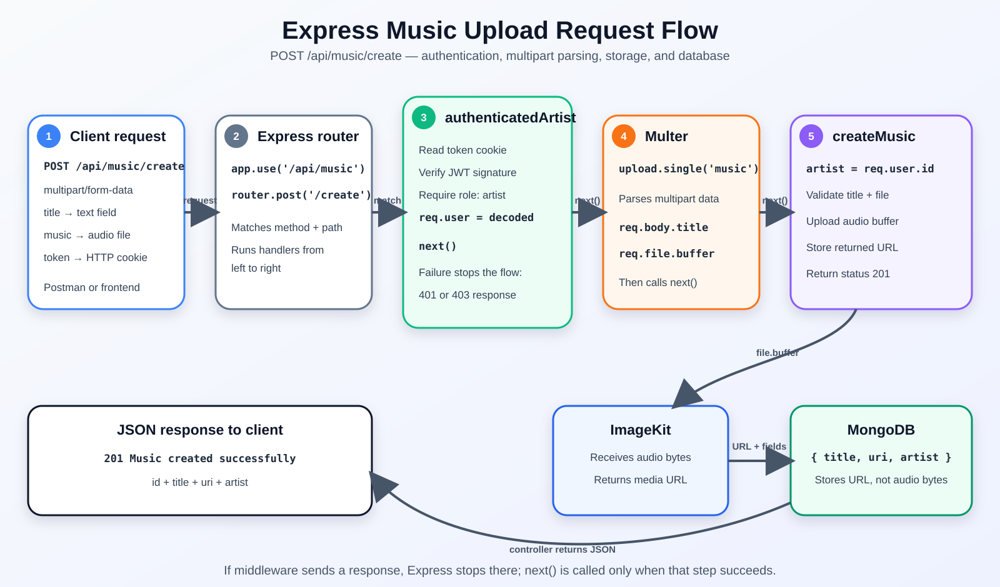

# Spotify Clone Backend - Development Flow

This README tracks the backend in development order: what was built, how requests flow, current problems, and what comes next.

## Project goal

Build a Spotify-style backend with JWT authentication, role-based authorization, users, artists, songs, albums, and playlists.

Current roles are `user` and `artist`.

## Step 1: Initialize the backend

- Create the Node.js project and enable ES modules with `type: module`.
- Install Express, Mongoose, dotenv, cookie-parser, and jsonwebtoken.
- Organize the source into application, database, model, controller, and route layers.

## Step 2: Configure environment variables

Create `06spotifyclone/.env` and keep it ignored by Git.

```env
MONGODB_URI=<private MongoDB Atlas URI>
JWT_SECRET=<private random signing secret>
IMAGEKIT_PUBLIC_KEY=<your ImageKit public key>
IMAGEKIT_PRIVATE_KEY=<your ImageKit private key>
IMAGEKIT_URL_ENDPOINT=<your ImageKit URL endpoint>
```

- Reuse the Atlas cluster URI from `05authenticate`.
- Change the database path to `spotifyclone` so this app has separate collections.
- Never commit credentials or secrets.

## Step 3: Connect MongoDB

File: `src/db/db.js`

- Read `process.env.MONGODB_URI`.
- Connect through `mongoose.connect()`.
- Log success and stop the process on failure.
- If Atlas reports an IP whitelist error, allow the current development IP under Atlas Network Access.

## Step 4: Start the server after MongoDB

File: `server.js`

```js
await connectDB();
app.listen(3000);
```

The API opens port `3000` only after MongoDB connects.

## Step 5: Configure Express middleware

File: `src/app.js`

- `express.json()` converts incoming JSON into `req.body`.
- `cookieParser()` exposes cookies through `req.cookies`.
- `cors()` controls requests from a frontend on another origin.
- The authentication router is mounted at `/api/auth`.

## Step 6: Create the user model

File: `src/models/userModel.js`

The schema contains:

- `username`: required and unique.
- `email`: required and unique.
- `password`: required.
- `role`: either `artist` or `user`; the default is `user`.

## Step 7: Create the registration controller

File: `src/controllers/auth.controller.js`

The `registerUser` controller:

1. Reads `username`, `email`, `password`, and `role` from `req.body`.
2. Uses `user` as the default role.
3. Rejects missing fields with status `400`.
4. Uses a MongoDB `$or` query to detect an existing username or email.
5. Creates the user with `UserModel.create()`.
6. Signs a JWT containing `{ id: user._id }` with a one-hour expiry.
7. Places the JWT in an HTTP-only cookie named `token`.
8. Returns status `201` after registration.

> [!IMPORTANT]
> **Security Note: Password Hashing**
> Passwords should never be stored in plain text. Simple deterministic hashing algorithms (like MD5 or SHA-256 without a salt) are also vulnerable to brute-force and pre-computed lookup tables (Rainbow Tables), because the same plain text always produces the same hash. 
> To prevent this, we use `bcrypt` (via `bcryptjs`), which:
> 1. Generates a unique, random **salt** for every hash, ensuring that identical passwords result in completely different hashes.
> 2. Implements **key stretching** (with a configurable work factor/rounds) to make brute-forcing computationally expensive.

## Step 8: Create and mount the authentication router

Route file: `src/routes/auth.routes.js`

```js
router.post('/register', registerUser);
```

Mount path in `src/app.js`:

```js
app.use('/api/auth', authRoutes);
```

Final endpoint:

```text
/api/auth + /register = POST /api/auth/register
```

## Step 9: Create the login controller and route

File: `src/controllers/auth.controller.js` and `src/routes/auth.routes.js`

The `loginUser` controller:
1. Reads `username`, `email`, and `password` from `req.body` (allowing login via username or email).
2. Validates that either `username` or `email` is supplied, along with `password`.
3. Finds the user in the database using an `$or` query matching either the `username` or the `email` dynamically.
4. Compares the plain-text password with the stored hashed password using `bcrypt.compare()`.
5. Returns `401 Unauthorized` if credentials are invalid.
6. Signs a JWT token and places it in an HTTP-only cookie.
7. Returns a safe user object without the password.

Endpoint:
```text
/api/auth + /login = POST /api/auth/login
```

## Step 10: Create and mount the music router

File: `src/routes/music.routes.js` and `src/controllers/music.controller.js`

- Created the music router and controller files for managing song, album, and playlist resources.
- Imported and mounted the music router in `src/app.js`.

Mount path in `src/app.js`:
```js
app.use("/api/music", musicRoutes);
```

## Step 11: Implement music controllers with authentication & authorization

File: `src/controllers/music.controller.js` and `src/routes/music.routes.js`

1. **`checkArtist` Middleware:**
   - Reads the JWT from HTTP-only cookies (`req.cookies.token`).
   - Verifies the token using `jwt.verify()` with `process.env.JWT_SECRET`.
   - Checks the user's role from the token payload. If the role is not `"artist"`, returns `403 Forbidden` (only artists can create music).
   - Attaches the decoded user payload containing `id` and `role` to `req.user` (`req.user = decoded`).
   - Calls `next()` to proceed to the controller.

2. **`createSong` Controller:**
   - Reads `title` and `uri` from `req.body`.
   - Restricts missing fields with status `400`.
   - Uses the authenticated artist's ID from `req.user.id` (extracted securely from the token) to set the `artist` reference in `musicModel.js`.
   - Creates the song in MongoDB and returns status `201`.

## Step 12: Integrate ImageKit for media storage

File: `src/services/storage.service.js`

- Installed `@imagekit/nodejs` package.
- Initialized the `ImageKit` client using credentials loaded from environment variables (`IMAGEKIT_PUBLIC_KEY`, `IMAGEKIT_PRIVATE_KEY`, and `IMAGEKIT_URL_ENDPOINT`).
- Created an `uploadFile(file)` service function that:
  1. Accepts the file buffer from the upload middleware.
  2. Converts the binary buffer into a Base64-encoded string (`file.toString("base64")`) required for upload.
  3. Uploads the file to ImageKit under the `"spotifyclone"` folder with a unique name prefixed by `"music_"` and a timestamp.
  4. Returns the upload response (containing URLs and file metadata) or handles connection errors.

## Registration request flow

```text
Client JSON request
        ↓
express.json()
        ↓
/api/auth router mount
        ↓
POST /register route
        ↓
registerUser controller
        ↓
UserModel and MongoDB
        ↓
JWT stored in HTTP-only cookie
        ↓
JSON response returned
```

## Postman Testing

### 1. Register Endpoint (`POST /api/auth/register`)

- **Method:** `POST`
- **URL:** `http://localhost:3000/api/auth/register`
- **Headers:** `Content-Type: application/json`
- **Body:** Select `raw` and choose `JSON` from the dropdown.

#### Example Request Body (Payload)
```json
{
  "username": "johndoe",
  "email": "johndoe@example.com",
  "password": "securepassword123",
  "role": "user"
}
```

#### Example Success Response (201 Created)
```json
{
  "message": "User registered successfully",
  "user": {
    "id": "64c3bc1e09c85a21e4c9e102",
    "username": "johndoe",
    "email": "johndoe@example.com",
    "role": "user"
  }
}
```

### 2. Login Endpoint (`POST /api/auth/login`)

- **Method:** `POST`
- **URL:** `http://localhost:3000/api/auth/login`
- **Headers:** `Content-Type: application/json`
- **Body:** Select `raw` and choose `JSON` from the dropdown.

#### Example Request Body (Payload with Username)
```json
{
  "username": "johndoe",
  "password": "securepassword123"
}
```

#### Example Request Body (Payload with Email)
```json
{
  "email": "johndoe@example.com",
  "password": "securepassword123"
}
```
*(You can also pass the email inside the `"username"` field, e.g., `"username": "johndoe@example.com"`).*

#### Example Success Response (200 OK)
```json
{
  "message": "Login successful",
  "user": {
    "id": "64c3bc1e09c85a21e4c9e102",
    "username": "johndoe",
    "email": "johndoe@example.com",
    "role": "user"
  }
}
```

### 3. Create Song Endpoint (`POST /api/music/create`)

- **Method:** `POST`
- **URL:** `http://localhost:3000/api/music/create`
- **Headers:** `Content-Type: application/json`
- **Authentication:** Requires you to be logged in first. Postman will automatically send the HTTP-only `token` cookie.
- **Body:** Select `raw` and choose `JSON` from the dropdown.

> [!NOTE]
> The creator's MongoDB `_id` is automatically extracted from your JWT token cookie. Only users registered with the role `"artist"` are authorized to call this endpoint (users with `"user"` role will receive `403 Forbidden`).

#### Example Request Body (Payload)
```json
{
  "title": "Faded",
  "uri": "https://www.soundhelix.com/examples/mp3/SoundHelix-Song-1.mp3"
}
```

#### Example Success Response (210 Created)
```json
{
  "message": "Song created successfully",
  "song": {
    "_id": "6a6a2da8ff86bbde9000a12",
    "title": "Faded",
    "uri": "https://www.soundhelix.com/examples/mp3/SoundHelix-Song-1.mp3",
    "artist": "6a6a284081bf02ca94cc8514",
    "__v": 0
  }
}
```

---

## Current blockers and security work

- [x] `src/app.js` imports `cors`, but `cors` is not listed in `package.json` (Resolved: Installed `cors`)
- [x] `src/app.js` points to incorrect path `../routes/...` (Resolved: Corrected import to `./routes/auth.routes.js`)
- [x] Passwords are stored as plain text (Resolved: Hashed passwords with `bcryptjs` before saving)
- [x] Registration returns the user document including password (Resolved: Returning only safe user fields)
- [ ] Cookies with `secure: true` require HTTPS. Make this environment-aware during local development.
- [ ] Add stronger email, password, and role validation.

## Next development steps

- [x] Fix the CORS dependency and router import path.
- [x] Hash passwords during registration.
- [x] Return a safe user response without the password.
- [x] Add login endpoint (`POST /api/auth/login`).
- [x] Add middleware that verifies the JWT cookie (`checkArtist` in `music.controller.js`).
- [x] Add artist-only authorization (`checkArtist` checks `role === "artist"`).
- [/] Build song, album, and playlist models and routes (Song model and creation routes finished).

## Step 13: Send a title and music file with multipart form data

JSON is designed for structured text values. A browser `File` contains binary bytes, so file uploads normally use `multipart/form-data`. Multipart creates separate parts inside one request: one part can contain the title and another part can contain the file bytes.

### Postman request

1. Select `POST http://localhost:3000/api/music/create`.
2. Open **Body** and select **form-data**.
3. Add `title` as a **Text** field.
4. Add `music` as a **File** field and choose an audio file. This name must match `upload.single('music')`.
5. Do not manually set `Content-Type`; Postman adds the required multipart boundary.

```text
Key     Type    Value
title   Text    Faded
music   File    faded.mp3
```

### Frontend request

```js
const formData = new FormData();
formData.append('title', title);
formData.append('music', selectedFile);

await fetch('http://localhost:3000/api/music/create', {
    method: 'POST',
    credentials: 'include',
    body: formData,
});
```

Do not manually add a `Content-Type` header when sending `FormData`; the browser generates it with the correct boundary.

### Backend parsing with Multer

Install Multer and use memory storage so the uploaded bytes remain available for ImageKit:

```bash
npm install multer
```

```js
import multer from 'multer';

const upload = multer({ storage: multer.memoryStorage() });

router.post('/create', upload.single('music'), createMusic);
```

After Multer parses the request:

```js
const { title } = req.body; // Text fields
const file = req.file;      // File metadata and buffer

const result = await uploadFile(file.buffer);
```

`express.json()` parses `application/json`, but it does not parse file uploads. Multer parses `multipart/form-data` and separates text into `req.body` and the selected file into `req.file`.

### Current upload-code blockers

1. Multer `2.2.0` is installed, memory storage is configured, and `upload.single('music')` is mounted.
2. `music.routes.js` currently imports a default `musicController`, but `music.controller.js` exports `createMusic` as a named export. Use `import { createMusic }` and pass `createMusic` directly to the route, or add a matching default export.
3. `decodedToken` is declared inside the `try` block but used outside that block.
4. `uploadFile()` needs the binary `file.buffer`; calling `file.toString('base64')` on the whole Multer object does not encode the audio bytes.

## Step 14: Configure the in-memory music upload middleware

The current router now configures Multer with `memoryStorage()` and accepts one file from the multipart field named `music`.

The controller uses a named export, so the matching route import is:

```js
import { createMusic } from '../controllers/music.controller.js';

const upload = multer({ storage: multer.memoryStorage() });

router.post('/create', upload.single('music'), createMusic);
```

Middleware executes from left to right. Multer parses the request first, places text fields in `req.body` and the audio file in `req.file`, and then `createMusic` handles the parsed values.

## Step 15: Correct the music upload implementation

- Import `createMusic` as a named export in `music.routes.js`.
- Keep the multipart field name as `music`.
- Validate both `title` and `req.file` before uploading.
- Pass `req.file.buffer` to the ImageKit storage service.
- Keep the decoded JWT outside the verification block so its user ID is available when creating the MongoDB document.
- Throw ImageKit failures back to the controller and return status `500` instead of treating an error as an upload result.
- Return a safe music object after successful creation.
- Load environment variables before constructing the ImageKit client so its keys exist during module initialization.

## Step 16: Return useful Multer upload errors

- Wrap `upload.single('music')` so Multer errors are returned as JSON instead of an HTML stack trace.
- Include `receivedField` in the response to show the incorrect Postman key.
- Include `expectedField: music` to show the exact key required by the router.
- Keep only one checked file row in Postman because `upload.single()` accepts one file.

## Step 17: Simplify the Multer route

After confirming that the Postman field mismatch was caused by `Music` instead of lowercase `music`, remove the temporary custom Multer error wrapper and mount the middleware directly:

```js
router.post('/create', upload.single('music'), createMusic);
```

This keeps the upload route easy to read. The Postman file key must remain exactly `music` because multipart field names are case-sensitive.

## Step 18: Artist access versus normal-user access

Both `user` and `artist` accounts can register and log in. After successful registration or login, the backend signs a JWT containing the saved user ID and role:

```js
{ id: user._id, role: user.role }
```

The music-creation controller verifies that token before creating a song.

```text
Register/login with role artist
        |
        v
JWT contains role: artist
        |
        v
POST /api/music/create is allowed
```

```text
Register/login with role user
        |
        v
JWT contains role: user
        |
        v
POST /api/music/create returns 403 Forbidden
```

An absent, invalid, or expired token returns `401 Unauthorized`. A valid token belonging to a normal user returns `403 Forbidden` because the user is authenticated but does not have artist permission.

The client must not choose a role during login. Login reads the trusted role already stored in MongoDB. For a production application, public users should also not be able to freely assign themselves the `artist` role during registration; artist approval should be controlled by the backend or an administrator.

## Current development test records

Passwords are intentionally excluded from this file and must never be committed.

Test artists:

| Username | Email | Role | Known ID |
|---|---|---|---|
| `alanwalker` | `alan@walker.com` | `artist` | Not recorded |
| `artist_two` | `artist2@example.com` | `artist` | `6a6c1922bc441e012dc9f0e2` |

Music created by `artist_two`:

| ID | Title | Artist ID | ImageKit URL |
|---|---|---|---|
| `6a6c1936bc441e012dc9f0e3` | `test_title2` | `6a6c1922bc441e012dc9f0e2` | `https://ik.imagekit.io/3itkoevwc/spotifyclone/music_1785469236037_9O4Kiac8r` |

## Step 19: Relate albums to music with Mongoose references

The music model is registered with the model name `music`:

```js
const musicModel = mongoose.model('music', musicSchema);
```

Therefore, the album schema can reference that model:

```js
music: {
    type: mongoose.Schema.Types.ObjectId,
    ref: 'music',
    required: true,
}
```

The album document stores only a music document `_id`. The `ref` value does not call `createMusic`, upload a file, or automatically fetch the music document. It tells Mongoose that this ObjectId belongs to the model named `music`.

### Why use a reference?

Without a reference, every album would need to copy the complete music title, URL, and artist data. That duplicates information and can become inconsistent when a song changes. A reference keeps the full song in the music collection and stores only its ID in the album.

Benefits:

- One music document is the single source of truth.
- Several albums or playlists can point to the same song without copying it.
- Updating the original music document updates what future populated queries see.
- Album documents stay smaller.

MongoDB does not enforce this reference like a SQL foreign key. The controller must supply a real music ID, and the application should validate that the music exists. If a referenced music document is deleted, the album ID does not disappear automatically.

Development flow:

```text
createMusic controller
        |
        v
musicModel.create() creates a music document
        |
        v
MongoDB returns music._id
        |
        v
createAlbum receives that ID
        |
        v
albumModel.create({ music: musicId }) stores the reference
```

Without population, an album query returns only the ID:

```js
const album = await albumModel.findById(albumId);
// album.music -> ObjectId
```

With population, Mongoose replaces the ID in the query result with the referenced music document:

```js
const album = await albumModel.findById(albumId).populate('music');
// album.music -> { _id, title, uri, artist }
```

The current album schema accepts one music ID, but `createAlbum` reads a plural `musicIds` value. If one album should contain multiple tracks, change the field to an array of references:

```js
music: [{
    type: mongoose.Schema.Types.ObjectId,
    ref: 'music',
    required: true,
}]
```

Then `albumModel.create({ music: musicIds })` can store an array. The album route is not mounted yet, and the current album controller also checks `req.file` even though album creation currently has no album-file upload middleware.

## Step 20: Select and validate an artist own songs for an album

Mongoose fetches referenced music by its `_id`; it does not need the creator ID to perform `populate('music')`. However, the `artist` field on each music document records ownership and prevents one artist from adding another artist songs without permission.

Recommended flow:

1. Verify the JWT and obtain the logged-in artist ID.
2. Fetch that artist music with `musicModel.find({ artist: decodedToken.id })`.
3. Show those songs in the frontend so the artist can select them.
4. Send the selected song IDs as `musicIds` when creating the album.
5. Query MongoDB to confirm every selected ID belongs to the logged-in artist.
6. Store the validated IDs in the album.
7. Use `.populate('music')` when fetching the album to replace the stored IDs with complete song documents.

Ownership validation example:

```js
const songs = await musicModel.find({
    _id: { $in: musicIds },
    artist: decodedToken.id,
});

if (songs.length !== musicIds.length) {
    return res.status(400).json({
        message: 'One or more songs are invalid or do not belong to you',
    });
}
```

The current album controller does not perform this ownership validation yet.

Important: Mongoose does not automatically place an artist's songs into an album. The relationship is created only when the client explicitly sends the selected `musicIds` to `createAlbum`, and the controller stores those IDs in the album document.

Example album request data:

```js
{
    title: 'Selected Songs Album',
    musicIds: [
        '6a6c1936bc441e012dc9f0e3',
        'anotherMusicId',
    ],
}
```

## Step 22: Document explicit album-song selection

- Explain in the controller that `musicIds` comes from songs selected by the artist in the frontend or Postman.
- Explain in the album model that the field stores those selected IDs as references.
- Clarify that `ref` and `populate()` can fetch referenced songs but do not decide which songs belong to an album.

## Step 23: Complete the album creation endpoint

- Change `musics` to an array of ObjectId references.
- Add `POST /api/albums/create` and mount the album router in `app.js`.
- Require an authenticated artist JWT cookie.
- Accept `title` and a non-empty `musicIds` array as JSON.
- Remove duplicate IDs and reject invalid ObjectId values.
- Verify every selected song exists and belongs to the logged-in artist.
- Store the validated music IDs in the album.
- Populate `musics` in the response to demonstrate the Mongoose relationship.

## Step 24: Simplify album creation for the learning version

The current controller accepts `musicIds` and stores the array directly:

```js
const album = await albumModel.create({
    title: title.trim(),
    musics: musicIds,
    artist: decodedToken.id,
});
```

Mongoose casts valid ObjectId strings using the album schema. Manual ID validation, duplicate removal, ownership checks, and response population were removed for now to keep the learning code short. They should be restored before production because this simplified version can accept duplicate IDs and IDs belonging to other artists. Invalid ObjectId strings can still cause a Mongoose cast error.

## Step 25: Use the existing music router for albums

The separate album router was removed to keep the learning project simple. `createAlbum` is now mounted in `music.routes.js`:

```js
router.post('/createAlbum', createAlbum);
```

Because `app.js` mounts that router at `/api/music`, the final endpoint is:

```text
POST /api/music/createAlbum
```

### Verified album creation

The endpoint successfully created this development album:

| Album ID | Title | Artist ID |
|---|---|---|
| `6a6d1d3153f9697c2619fa53` | `Two Song Album` | `6a6a284081bf02ca94cc8514` |

Stored music references:

- `6a6c178bbc441e012dc9f0e0`
- `6a6c1936bc441e012dc9f0e3`

This confirms that the client-supplied `musicIds` array is cast to ObjectIds and stored in the album `musics` array.

## Step 26: Reuse artist-authentication middleware

Both music and album creation now use `authenticatedArtist` before their controllers.

```text
Request
   |
   v
authenticatedArtist
   |-- reads token cookie
   |-- verifies JWT
   |-- checks role is artist
   |-- saves payload in req.user
   v
next()
   |
   v
upload.single('music') for music only
   |
   v
createMusic or createAlbum controller
```

`next()` tells Express to continue to the next function in the route. If authentication fails, the middleware sends `401` or `403` and does not call `next()`, so the controller never runs. The controllers now read `req.user.id` instead of repeating cookie and JWT verification.

### Visual request flow



The diagram uses the current upload endpoint, `POST /api/music/create`. The client sends `title`, the `music` file, and the login cookie. Express passes the request through `authenticatedArtist`, Multer, and `createMusic`; the controller uploads bytes to ImageKit, saves the resulting URL in MongoDB, and returns JSON.

## Step 27: Explain `req.user` in controllers

`req.user` is not provided automatically by Express. `authenticatedArtist` creates this custom property after verifying the JWT:

```js
const decodedToken = jwt.verify(token, process.env.JWT_SECRET);
req.user = decodedToken;
next();
```

The next controller receives the same request object:

```js
const decodedToken = req.user;
// decodedToken contains the verified payload: { id, role, iat }
```

This lets controllers use the authenticated artist ID and role without verifying the token a second time.

## Step 28: Fetch music and populate artist details

```js
const musics = await musicModel.find().populate('artist');
```

- `musicModel.find()` fetches every document from the music collection.
- Each music document normally contains only an artist ObjectId.
- `populate('artist')` reads `ref: 'user'` from the music schema and replaces that ObjectId in the query result with the matching user document.

Without population:

```js
{
    title: 'test_title',
    artist: ObjectId('6a6a284081bf02ca94cc8514'),
}
```

With population:

```js
{
    title: 'test_title',
    artist: {
        _id: '6a6a284081bf02ca94cc8514',
        username: 'alanwalker',
        email: 'alan@walker.com',
        role: 'artist',
    },
}
```

For a safer API response, select only fields that the client needs:

```js
const musics = await musicModel
    .find()
    .populate('artist', 'username role');
```

This avoids returning the referenced user password or other private fields.

## Step 29: Music fetch and populate request flow

Current endpoint:

```http
GET /api/music/getMusic
```

Complete flow:

```text
Logged-in user or artist sends GET /api/music/getMusic
        |
        v
music router matches router.get('/getMusic', ...)
        |
        v
authenticatedUser middleware
        |-- reads token cookie
        |-- verifies JWT
        |-- accepts role user or artist
        |-- sets req.user
        v
next()
        |
        v
getAllMusic controller
        |
        v
musicModel.find()
        |-- fetches music documents
        |-- artist is initially an ObjectId
        v
populate('artist')
        |-- reads ref: 'user' from musicSchema
        |-- fetches matching user documents
        |-- replaces artist ObjectIds in the result
        v
200 JSON response with music and artist details
```

`populate()` changes only the returned query result; MongoDB still stores the artist ObjectId in each music document.

Security note: the current `.populate('artist')` query can include the referenced user password hash. Restrict the populated fields before exposing this endpoint outside local development:

```js
const music = await musicModel
    .find()
    .populate('artist', 'username role');
```

## Step 30: Fetch one album and its music

Current protected endpoint:

```http
GET /api/music/album/:id
```

Route:

```js
router.get('/album/:id', authenticatedUser, getMusicByAlbumId);
```

Controller query:

```js
const album = await albumModel
    .findById(req.params.id)
    .populate('musics');
```

Flow:

```text
GET /api/music/album/:id
        |
        v
authenticatedUser verifies the cookie
        |
        v
getMusicByAlbumId reads req.params.id
        |
        v
albumModel.findById(id) fetches the album
        |
        v
populate('musics') replaces stored music IDs
        |
        v
200 JSON response with the album and complete music documents
```

Postman example using the verified development album:

```http
GET http://localhost:3000/api/music/album/6a6d1d3153f9697c2619fa53
```

No request body is required. Postman must have a valid login `token` cookie because the route uses `authenticatedUser`.

### Verified populated album response

Fetching album `6a6d1d3153f9697c2619fa53` successfully returned `Two Song Album` with two populated music documents:

| Music ID | Title | Artist ID |
|---|---|---|
| `6a6c178bbc441e012dc9f0e0` | `test_title` | `6a6a284081bf02ca94cc8514` |
| `6a6c1936bc441e012dc9f0e3` | `test_title2` | `6a6c1922bc441e012dc9f0e2` |

This verifies that `.populate('musics')` replaces the stored album ObjectIds with complete music documents in the query result.

It also demonstrates the simplified controller tradeoff: the album owner is `6a6a284081bf02ca94cc8514`, but the second song belongs to another artist. This is currently allowed because ownership validation was intentionally removed in Step 24 and should be restored before production if albums may contain only their creator's songs.

Postman test after logging in as the artist who owns the selected songs:

The album router must be mounted with `app.use('/api/albums', albumRoutes)`; otherwise Express returns `Cannot POST /api/albums/create`.

```http
POST http://localhost:3000/api/albums/create
Content-Type: application/json
```

```js
{
    title: 'Artist Two Album',
    musicIds: [
        '6a6c1936bc441e012dc9f0e3',
    ],
}
```

## Step 21: Add focused code comments

- Explain that Multer separates text fields and the uploaded file.
- Explain that ImageKit stores the audio while MongoDB stores its URL.
- Explain that JWT payload data identifies the authenticated artist.
- Explain that Mongoose `ref` supports population and does not copy documents.
- Mark the current single-music album schema, album-file check, and ownership validation as TODO items.

## MongoDB startup troubleshooting

If nodemon prints `ReplicaSetNoPrimary`, `commonWireVersion: 0`, and then reports that the app crashed, MongoDB Atlas did not allow the connection. The application intentionally exits because `server.js` waits for MongoDB before opening the API port.

Recovery steps:

1. Open the MongoDB Atlas project containing the cluster.
2. Go to **Security > Network Access**.
3. Add the current development IP address to the IP Access List.
4. Wait for the Atlas rule to become active.
5. Restart nodemon or type `rs` in the nodemon terminal.

Avoid allowing `0.0.0.0/0` for a real deployment because it permits connection attempts from every IP. Deployment servers should use an appropriately restricted Atlas network rule when the hosting provider supports stable outbound IP addresses.

Status: resolved for local development after adding the current IP to Atlas. A direct Mongoose handshake successfully connected to the `spotifyclone` database.

### Request data versus stored database data

The location of incoming data is determined by the request format and Multer, not by whether MongoDB can store it.

```text
multipart text field  -> req.body.title
one uploaded file     -> req.file
multiple files        -> req.files
actual in-memory bytes -> req.file.buffer
```

The backend uploads `req.file.buffer` to ImageKit. ImageKit returns a public media URL, and MongoDB stores that URL as ordinary text alongside the title and artist ID.

```text
req.file.buffer
        |
        v
ImageKit upload
        |
        v
ImageKit media URL
        |
        v
MongoDB song document: { title, uri, artist }
```

When the song is fetched later, MongoDB returns a normal object containing `title`, `uri`, and `artist`. The frontend uses `uri` to load or play the audio from ImageKit; the original upload does not come back through `req.file`.
